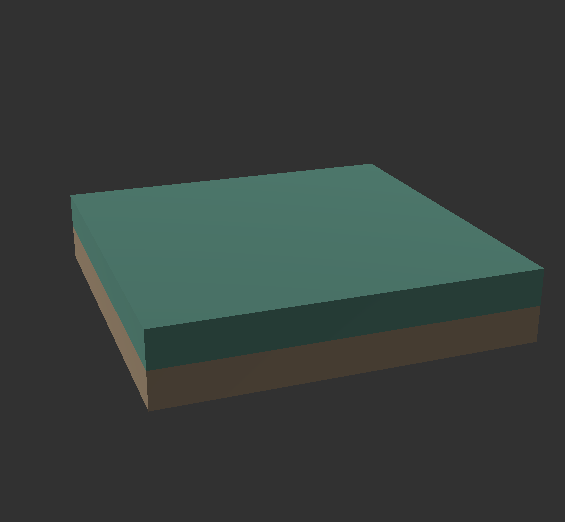
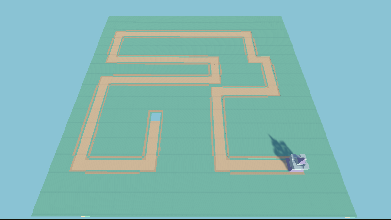

# Chapitre 1 : Création de la Carte (Node)
## Introduction

Bienvenue dans le premier chapitre de notre cours CodeGaming sur la création d'un jeu de Tower Defense en 3D ! 🚀 Aujourd'hui, nous allons nous concentrer sur la création de la carte du jeu, un élément fondamental qui définira la zone sur laquelle les joueurs pourront placer leurs tours.🏰

## Objectifs du Chapitre

- Comprendre le concept de "Node" comme élément de base de la carte. 🟦
  
- Apprendre à configurer et utiliser un asset pour représenter un sol modulaire. 🛠️
  
- Dupliquer cet asset en fonction de la taille souhaitée de la carte (dans notre cas, une carte de 16x16). 🔄
  
- Créer un chemin en supprimant des "Nodes". 🛤️
  
- Placer une base d'ennemis et une base d'alliés. 🏰⚔️

### Étape 1 : Récupérer un Asset pour le Sol

Avant de commencer la programmation, nous devons choisir un asset carré qui représentera le sol sur lequel les tours seront placées. Voici quelques suggestions :

- 👉 Utiliser un asset existant dans le Unity Asset Store.
- 👉 Créer votre propre asset dans un logiciel de modélisation 3D comme Blender.
- 👉 Trouver sur un site tier un fichier .fbx pour votre "Node"

Pour notre exemple, nous appellerons cet asset "Node".

### Étape 2 : Configuration du "Node"

#### Importer l'Asset
Téléchargez ou créez votre asset carré.
Importez-le dans Unity en le déposant dans le dossier Assets.
#### Créer un Préfab
Faites glisser l'asset "Node" dans la scène.

Configurez les éléments comme les matériaux et les collisions si nécessaire.

Faites glisser l'objet de la scène vers le dossier Assets pour créer un préfab.

### Étape 3 : Duplication des "Nodes" pour Créer la Carte

Nous allons maintenant créer une grille de "Nodes" de 16x16 pour notre carte.

### Étape 4 : Création d'un Chemin et Placement des Bases

   
Identifiez les "Nodes" à supprimer pour créer un chemin entre la base des ennemis et celle des alliés. Par exemple, vous pouvez créer un chemin en forme de serpentin ou une ligne droite.

#### Placer la Base des Ennemis 
   
Importez ou créez un asset pour représenter la base des ennemis. 🏴

Placez-le à l'un des coins de la carte, par exemple en position (0, 0).

#### Placer la Base des Alliés :
   
Importez ou créez un asset pour représenter la base des alliés. ⚔️

Placez-le à l'autre extrémité du chemin, par exemple en position (15, 15).

# Conclusion

Avec ces étapes, non seulement vous aurez une carte de 16x16 composée de "Nodes", mais vous aurez également créé un chemin pour les ennemis et placé les bases des alliés et des ennemis. Cela constitue la base sur laquelle vous pourrez ajouter des fonctionnalités plus complexes dans les chapitres suivants.

Rendez-vous au prochain chapitre où nous aborderons [IA de nos ennemis ! 🏰💡](https://github.com/g404-code-gaming/TowerDefence/blob/main/Création-Du-Jeu/02.IA%20des%20ennemis.md)
