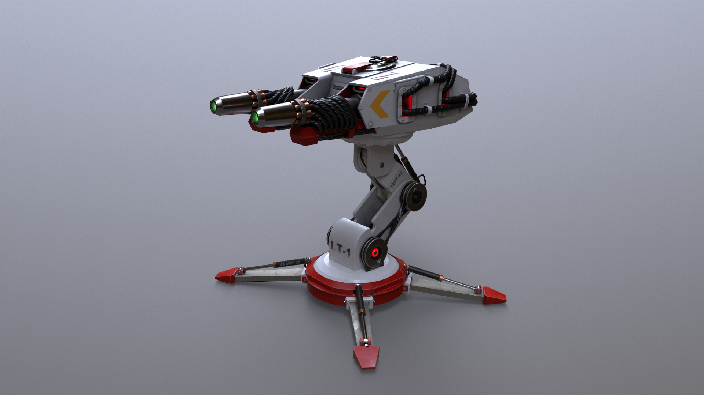

# Chapitre 4 : Création de la Première Tourelle

## Introduction

Bienvenue dans le quatrième chapitre de notre cours CodeGaming sur la création d'un jeu de Tower Defense en 3D ! 🚀 Aujourd'hui, nous allons créer notre première tourelle. 🏰

## Objectifs du Chapitre

- Rechercher ou télécharger un asset de tourelle. 🔍
- Configurer une bonne architecture avant de créer le prefab. 🛠️
- Ajouter des matériaux pour colorer le prefab. 🎨
- Écrire un script Turret modulable pour gérer les types de tourelles sans modifications de code importantes. 💻

### Étape 1 : Recherche d'un Asset de Tourelle 🔍
Les élèves ont deux options pour obtenir une tourelle :

#### Recherche sur Internet :
Les élèves peuvent rechercher un modèle de tourelle compatible sur des sites comme TurboSquid, Free3D, ou le Unity Asset Store. 🌐
Attention : Assurez-vous de choisir un modèle qui correspond à l'architecture de votre jeu pour faciliter l'intégration. 🧩

#### Utilisation d'un Lien fourni :
En guise d'alternative, pour ceux qui préfèrent, un lien pour télécharger [un asset complet de tourelle sera fourni. 📥](https://devassets.com/assets/tower-defense-assets/)

### Étape 2 : Configuration de l'Architecture du Prefab 🛠️
Avant de créer le prefab, assurez-vous que votre modèle de tourelle est bien organisé :

#### Structurer le Modèle :
Placez le modèle 3D dans un GameObject vide pour le structurer correctement. 📦

#### Ajouter des Composants :
Ajoutez les composants nécessaires comme les colliders, les scripts, etc. 🔧

### Étape 3 : Ajouter des Matériaux 🎨
Pour donner vie à votre tourelle, ajoutez des matériaux et textures :

#### Créer des Matériaux :
Créez des matériaux dans Unity pour définir les couleurs et textures de votre tourelle. 🎨

#### Appliquer les Matériaux :
Appliquez ces matériaux à votre modèle de tourelle pour finaliser son apparence. 🖌️

### Étape 4 : Écrire le Script Turret 💻

Nous allons maintenant écrire un script [Turret.txt](https://github.com/user-attachments/files/17812328/Turret.txt) modulable pour que chaque type de tourelle puisse reconnaître sa cible et se diriger vers elle sans modifications de code importantes. Le script doit reconnaître sa cible en fonction d'un tag spécifique dans une certaine portée (range).

Attention : Assurez-vous d'avoir une bonne architecture avant de créer le prefab. Cela facilitera les modifications et l'ajout de nouvelles fonctionnalités.

# Conclusion
Avec ces étapes, vous aurez créé une tourelle fonctionnelle et modulable capable de cibler et d'attaquer les ennemis dans une certaine portée. 🚀

Rendez-vous au prochain chapitre où nous aborderons [l'implémentation des attaques. ⚔️🔥](https://github.com/g404-code-gaming/TowerDefence/blob/main/Création-Du-Jeu/05.Tir%20des%20tourelles.md)

