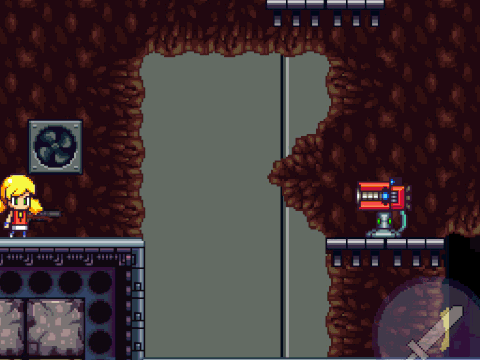
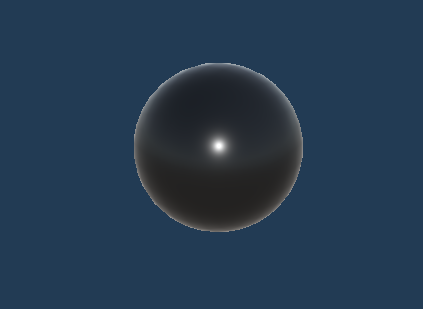
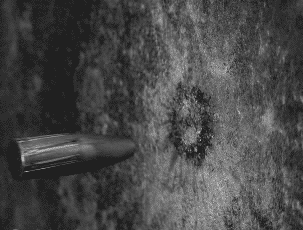

# Chapitre 5 : Système de Tir des Tourelles

## Introduction

Bienvenue dans le cinquième chapitre de notre cours CodeGaming sur la création d'un jeu de Tower Defense en 3D ! 🚀 Aujourd'hui, nous allons mettre en place le système de tir de nos tourelles. 🔫

## Objectifs du Chapitre

- Modifier le code Turret pour tirer sur les ennemis. 💻
- Ajouter un point d'apparition pour les balles sur la tourelle. 📍
- Créer et designer les balles avec les matériaux et composants nécessaires. 🌌
- Écrire le script Bullet pour gérer le comportement des balles. 💥
- Créer un système de particules pour les impacts des balles sur les ennemis. ✨

### Étape 1 : Modification du Code Turret 💻
Modifions le code [Turret](https://github.com/user-attachments/files/17813702/Turret2.txt) pour que la tourelle tire sur les ennemis.
Récupérer que les partis a ajoutée.

#### Ajouter les Variables :
Ajoutez les variables pour gérer le tir, comme le temps entre les tirs (fireRate) et le compte à rebours (cooldown) (fireCountdown).

#### Ajouter les Méthodes :
Ajoutez les méthodes pour tirer et gérer le cooldown.

Attention : Assurez-vous d'intégrer ces modifications de manière propre et modulaire pour faciliter l'ajout de fonctionnalités futures.

### Étape 2 : Ajouter un Point d'Apparition pour les Balles 📍

#### Créer un Point d'Apparition :
Dans Unity, créez un GameObject vide et nommez-le FirePoint. Positionnez-le à l'endroit souhaité sur la tourelle.

#### Associer le Point d'Apparition :
Associez ce point d'apparition dans le script Turret.

### Étape 3 : Créer et Designer les Balles 🌌

#### Créer un Prefab de Balle :
Créez un nouveau GameObject pour la balle et ajoutez les composants nécessaires comme le collider et le rigidbody.

#### Ajouter des Matériaux :
Créez et appliquez un matériau pour donner une apparence à votre balle.

### Étape 4 : Écrire le Script Bullet 💥
Créez un script nommé [Bullet](https://github.com/user-attachments/files/17814190/Bullet.txt) pour gérer le comportement des balles

#### Déplacement de la Balle :
Faites en sorte que la balle se déplace vers la cible et inflige des dégâts à l'impact.

#### Destruction de la Balle :
Détruisez la balle après l'impact ou après un certain temps pour éviter les fuites de mémoire.

### Étape 5 : Créer un Système de Particules pour les Impacts ✨

#### Créer un Effet de Particules :

Utilisez le système de particules de Unity pour créer un effet visuel lorsque la balle touche un ennemi.

#### Associer l'Effet au Script Bullet :
Dans le script Bullet, faites apparaître les particules à l'impact.

# Conclusion
Avec ces étapes, vous aurez mis en place un système de tir de tourelles complet, incluant les balles et les effets de particules d'impact. 🚀

Rendez-vous au prochain chapitre où nous aborderons l'amélioration des statistiques des tourelles et des ennemis. 📊⚔️
