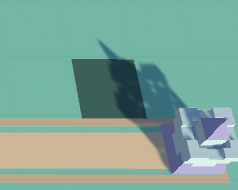
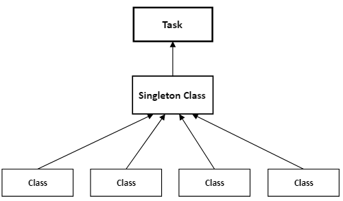

# Chapitre 6 : Construction de Tourelles et Singleton

## Introduction

Bienvenue dans le sixième chapitre de notre cours CodeGaming sur la création d'un jeu de Tower Defense en 3D ! 🚀 Aujourd'hui, nous allons nous concentrer sur la création d'un script interactif pour les nodes et l'implémentation d'un Singleton pour le BuildManager. 🛠️

## Objectifs du Chapitre

Créer un script Node pour interagir avec les nodes (points de placement de tourelles). 🖱️
Comprendre ce qu'est un Singleton via une explication simple et un exemple. 📚
Implanter un Singleton BuildManager et l'ajouter à l'objet GameManager. 💻

### Étape 1 : Création du Script Node 🖱️

#### Créer le Script Node :

Les élèves vont créer un script C# appelé [Node](https://github.com/user-attachments/files/17816545/Node.txt) pour les points de placement des tourelles.
Le script doit changer la couleur du node lorsqu'on passe la souris dessus (mouseover) pour indiquer qu'il est interactif.

### Explication du Singleton 📚
#### Qu'est-ce qu'un Singleton ?

Un Singleton est un modèle de conception qui permet de s'assurer qu'une classe n'a qu'une seule instance et fournit un point d'accès global à cette instance. C'est comme si vous aviez un seul chef cuisinier dans une cuisine. Si tout le monde doit demander des instructions de cuisine, ils vont toujours s'adresser à la même personne.

#### Exemple de la Vie de Tous Les Jours

Imaginez une école où il n'y a qu'un seul principal. Tous les élèves et les enseignants doivent parler au même principal pour obtenir des décisions importantes. Peu importe qui demande, ils accèdent toujours à ce même principal.

En programmation, le Singleton garantit qu'il n'y a qu'une seule instance de cette classe accessible de n'importe où dans le code.

### Étape 2 : Implémentation du Singleton BuildManager 💻
#### Créer le Script BuildManager :
Les élèves vont créer un script C# nommé [BuildManager](https://github.com/user-attachments/files/17816270/BuildManager.txt) pour gérer la construction des tourelles.
Ils doivent implanter ce script en Singleton pour s'assurer qu'il n'y a qu'une seule instance de BuildManager.

#### Ajouter BuildManager à GameManager :
Le script BuildManager doit être ajouté à l'objet GameManager dans Unity.

## Conclusion
Avec ces étapes, les élèves auront implémenté un script interactif pour les nodes et compris l'importance d'un Singleton avec un BuildManager. 🚀

Rendez-vous au prochain chapitre où nous aborderons [Gestion de la caméra. 🎮✨](https://github.com/g404-code-gaming/TowerDefence/blob/main/Création-Du-Jeu/07.Gestion%20de%20la%20caméra.md)
