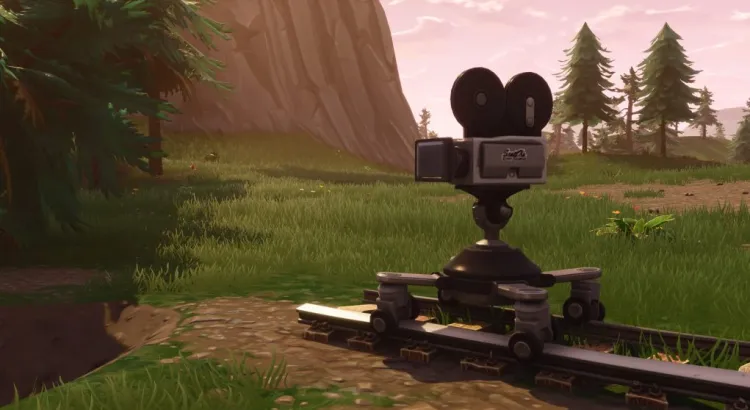
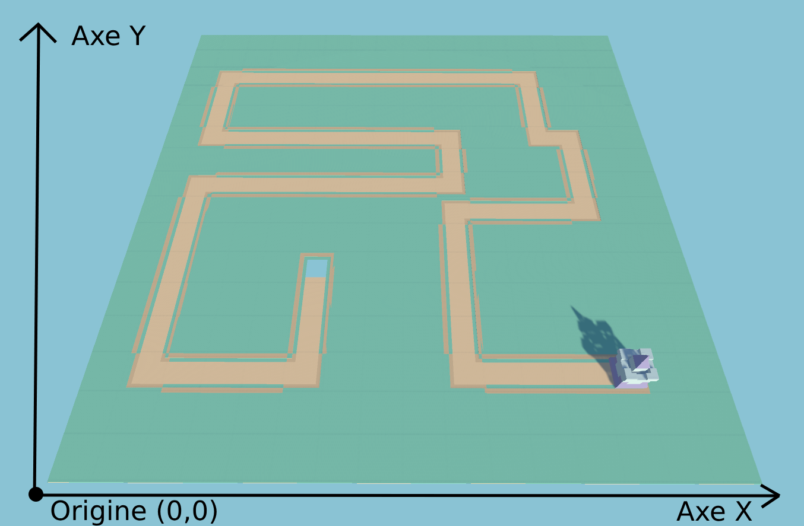
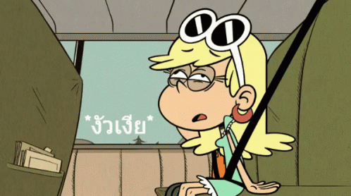

# Chapitre 7 : Gestion de la Caméra

## Introduction

Bienvenue dans le septième chapitre de notre cours CodeGaming sur la création d'un jeu de Tower Defense en 3D ! 🚀 Aujourd'hui, nous allons nous concentrer sur la gestion de la caméra pour permettre aux joueurs de déplacer la caméra et utiliser le zoom. 🎥

## Objectifs du Chapitre

- Déplacer la caméra en fonction de la position du curseur de la souris. 🖱️
- Implémenter le zoom et le dézoom de la caméra. 🔍
- Inclure une petite fonction mathématique pour gérer le mouvement de la caméra de manière fluide. 📐
- Comprendre et éviter la motion sickness (mal des transports) grâce à de bonnes pratiques. 🎢

### Étape 1 : Déplacement de la Caméra 🖱️
#### Analyser le Mouvement de la Souris :
Créez un script "[CameraController](https://github.com/user-attachments/files/17816905/CameraController.txt)" pour détecter la position du curseur de la souris.
Utilisez cette position pour déterminer la direction du mouvement de la caméra.

#### Implémenter le Déplacement de la Caméra :
Ajoutez une logique pour déplacer la caméra lorsqu'elle atteint les bords de l'écran.
Utilisez des facteurs de multiplication pour ajuster la vitesse de déplacement.

### Étape 2 : Zoom et Dézoom 🔍
#### Configurer le Composant Caméra :
Ajoutez des contrôles pour permettre le zoom in et le zoom out de la caméra.
Utilisez la molette de la souris pour ajuster le zoom.

### Étape 3 : Fonction Mathématique pour le Mouvement 📐
Pour rendre le mouvement de la caméra plus fluide et intuitif, nous allons utiliser une fonction mathématique simple.

#### Chercher une Fonction Mathématique :
Cherchez une fonction mathématique appropriée pour les déplacements fluides (comme l’interpolation linéaire ou une fonction d'accélération/décélération).

#### Appliquer la Fonction :
Intégrez cette fonction dans le script de gestion de la caméra pour adoucir les mouvements.

### Étape 4 : Éviter la Motion Sickness 🎢
##### Qu'est-ce que la Motion Sickness ?

La motion sickness, ou mal des transports, survient lorsque le cerveau reçoit des messages conflictuels concernant la position et le mouvement du corps. Dans les jeux vidéo, cela peut se produire lorsque les mouvements de la caméra sont trop brusques ou imprévisibles.

#### Bonnes Pratiques pour Éviter la Motion Sickness

- Assurez-vous que les mouvements de la caméra sont lents et fluides.
Évitez les accélérations et décélérations brusques.

- Limiter les Oscillations :
Évitez les mouvements de caméra oscillatoires ou trop rapides qui peuvent désorienter le joueur.

- Réduire le Tremblement de la Caméra :
Utilisez des scripts pour stabiliser la caméra et réduire le tremblement.

 - Angles de Vue Confortables :
Gardez une perspective et des angles de caméra qui sont confortables pour la vision humaine.

 - Offrir des Options de Contrôle :
Permettez aux joueurs d'ajuster la sensibilité de la caméra et le champ de vision selon leurs préférences.

## Conclusion
Avec ces étapes et bonnes pratiques, vous aurez mis en place un système de gestion de caméra efficace et confortable pour les joueurs, en évitant la motion sickness. 🚀

Rendez-vous au prochain chapitre pour aborder des fonctionnalités [d'achats de tours. 🎮✨](https://github.com/g404-code-gaming/TowerDefence/blob/main/Création-Du-Jeu/08.système%20de%20magasin.md)
