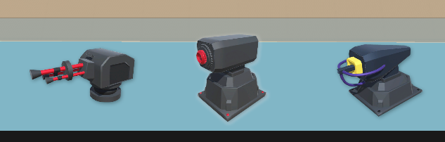
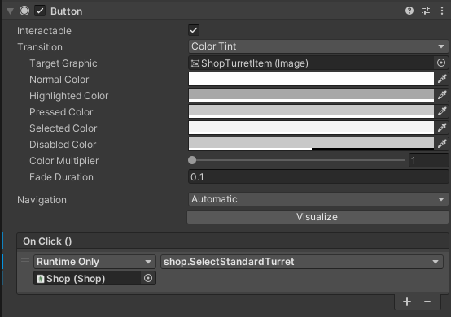

# Chapitre 8 : Système d'Achat des Tours

## Introduction

Bienvenue dans le huitième chapitre de notre cours CodeGaming sur la création d'un jeu de Tower Defense en 3D ! 🚀 Aujourd'hui, nous allons nous concentrer sur la mise en place d'un système d'achat de tours. 💰

## Objectifs du Chapitre

- Créer une interface utilisateur (UI) avec des boutons pour acheter des tours en utilisant les composants de layout et d'alignement. 🖥️
- Écrire le code du script Shop pour gérer les achats. 💻
- Retoucher les scripts BuildManager et Node pour intégrer le système de shop dans le jeu. 🛠️

### Étape 1 : Création de l'UI pour les Achats 🖥️



#### Créer une Interface Utilisateur :
Dans Unity, créez un canvas pour l'UI et ajoutez des boutons pour chaque type de tour disponible à l'achat.
Utilisez les composants Horizontal Layout Group ou Vertical Layout Group pour aligner les boutons de manière propre et intuitive.

#### Configurer les Boutons :
Ajoutez des icônes et des labels aux boutons pour indiquer clairement quel type de tour chaque bouton représente.
Assurez-vous que les boutons sont interactifs et stylisés de manière cohérente avec le reste du jeu.

### Étape 2 : Écriture du Script Shop 💻
#### Créer le Script Shop :
Créez un nouveau script C# nommé [Shop](https://github.com/user-attachments/files/17827766/Shop.txt) pour gérer les achats de tours.
Ce script doit avoir des méthodes pour sélectionner la tour à acheter lorsque le joueur clique sur un bouton.

#### Assigner des Méthodes aux Boutons :
Assignez les méthodes du script Shop aux boutons dans l'UI pour qu'ils appellent les fonctions appropriées lors du clic.



### Étape 3 : Retoucher les Scripts BuildManager et Node 🛠️
#### Intégrer Shop avec BuildManager :
Modifiez le script BuildManager pour qu'il prenne en compte la tour sélectionnée dans le Shop lors de la construction.

(Supprimer le start et faire un setter)

#### Faire un setteur

 ```csharp
public void SetTurretToBuild( Type Nom)
 {
  variable tourelle = Nom;
 }
```

#### Modifier le Script Node :
Faites en sorte que le script [Node](https://github.com/user-attachments/files/17829427/Node2.txt) utilise l'information de BuildManager pour placer la bonne tour sur le Node sélectionné.

## Conclusion
Avec ces étapes, vous aurez mis en place un système d'achat de tours complet, avec une UI interactive et une logique de gestion des achats intégrée. 🚀

Rendez-vous au prochain chapitre pour aborder [une nouvelle tourelle pour le jeu. 🎮✨](https://github.com/g404-code-gaming/TowerDefence/blob/main/Création-Du-Jeu/09.Ajout%20lance%20missiles.md)

