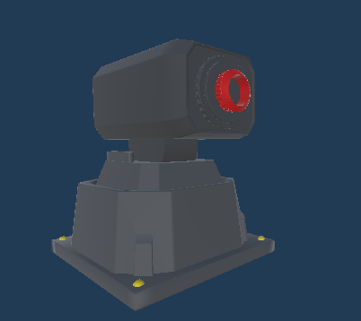

# Chapitre 9 : Ajout du Lance-Missile

## Introduction

Bienvenue dans le neuvième chapitre de notre cours CodeGaming sur la création d'un jeu de Tower Defense en 3D ! 🚀 Aujourd'hui, nous allons ajouter une nouvelle unité : le lance-missile. 💥

## Objectifs du Chapitre

- Rechercher et importer l'asset du lance-missile dans Unity. 🎨
- Appliquer des matériaux pour colorer le lance-missile. 🌈
- Configurer la hiérarchie pour que seule la tête de la tourelle tourne. 🔄
- Ajouter le script de tourelle (Turret) au lance-missile. 📜
- Intégrer le lance-missile au système de shop et BuildManager. 🏗️
- Ajouter un bouton dans l'UI pour sélectionner le lance-missile. 🖱️

### Étape 1 : Recherche et Importation de l'Asset 🎨
#### Rechercher l'Asset :
Trouvez un modèle 3D de lance-missile approprié. Vous pouvez utiliser des ressources en ligne ou créer un modèle personnalisé.

#### Importer dans Unity :
Ajoutez le modèle 3D à votre projet Unity en l'important dans le bon dossier (par exemple, sous Assets/Models).

### Étape 2 : Appliquer des Matériaux 🌈
#### Créer des Matériaux :
Créez ou importez des matériaux dans Unity pour colorer le lance-missile.

#### Appliquer les Matériaux :
Appliquez ces matériaux aux différentes parties du modèle 3D, notamment la structure et les missiles.

### Étape 3 : Configurer la Hiérarchie 🔄
#### Configurer la Hiérarchie :
Organisez l'objet du lance-missile pour que seule la tête de la tourelle tourne. Par exemple, séparez les parties fixées des parties mobiles dans l'éditeur d'Unity.

### Étape 4 : Ajouter le Script Turret 📜
#### Ajouter le Script :
Attachez le script Turret déjà utilisé par vos autres tourelles au modèle du lance-missile.

### Étape 5 : Intégrer au Système de Shop et BuildManager 🏗️
#### Modifier le BuildManager
   
Assurez-vous que BuildManager peut gérer la sélection et la construction du lance-missile comme pour les autres tourelles.

(Indice : rajouté une variable)
#### Ajouter au Script Shop :

A vous de jouer! 
créé la fonction "SelectMissileLauncher" en vous inspirant de SelectStandardTurret.

Ajoutez le lance-missile comme une option d'achat dans le script Shop.

### Étape 6 : Ajouter un Bouton dans l'UI 🖱️
#### Créer un Bouton de Sélection :
   
Dans l'UI, ajoutez un nouveau bouton pour le lance-missile. Assurez-vous que le bouton utilise une image ou un icône représentative du lance-missile.

#### Assigner les Actions :
   
Associez le bouton aux fonctions du Shop pour sélectionner le lance-missile lors de l'achat.

## Conclusion
Avec ces étapes, les élèves auront ajouté une nouvelle unité de lance-missile au jeu, améliorant ainsi la diversité des stratégies disponibles. 🚀

Rendez-vous au prochain chapitre pour [configurer votre lance missile ! 🎮✨](https://github.com/g404-code-gaming/TowerDefence/blob/main/Création-Du-Jeu/10.Configuration%20du%20lance-missiles.md)
