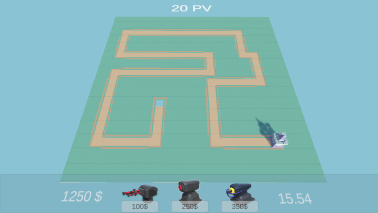
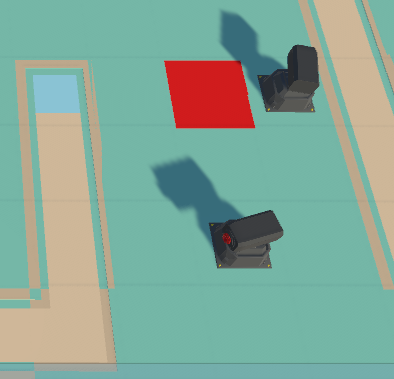
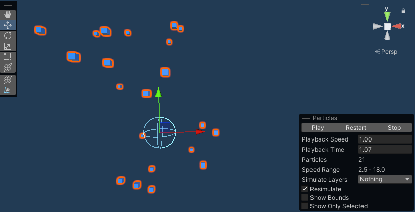

# Chapitre 12 : Amélioration du Rendu Visuel

## Introduction

Bienvenue dans le douzième chapitre de notre cours CodeGaming, dédié à l'amélioration visuelle de votre jeu de Tower Defense 3D. 🌟

## Objectifs du Chapitre

- Retoucher le système de Node et BuildManager pour indiquer visuellement un manque d'argent. 💰
- Améliorer l'UI avec l'affichage des prix des tours.
- Mettre en place un script MoneyUI pour gérer l'affichage de la monnaie.
- Créer un nouvel effet de particule qui s'active lorsque la tour est placée.

### Étape 1 : Retoucher le Système de Node et BuildManager 🎨
#### Changer la Couleur de la Node :
Modifiez le script Node pour qu'il change de couleur lorsque le joueur n'a pas assez d'argent pour acheter une nouvelle tour.

### Étape 2 : Script MoneyUI pour l'Affichage de la Monnaie 📈
#### Créer le Script MoneyUI :
Écrivez un script qui met à jour l'affichage de la monnaie du joueur en temps réel pendant le jeu.

- Bibliothèques Nécessaires : Utilisez les namespaces nécessaires pour la gestion de l'interface utilisateur, notamment UnityEngine.UI et TMPro pour le texte.

- Composants UI : Déclarez une variable publique MoneyTXT de type TextMeshProUGUI. Cela permettra de lier votre script à l'élément de texte dans l'interface utilisateur.

- Mise à Jour du Texte : Utilisez la méthode Update pour modifier le texte de MoneyTXT de manière à ce qu'il affiche le montant actuel de l'argent du joueur, formaté avec un symbole "$". Pour cela, faites référence à la variable Money dans le script PlayerStats.

#### Intégration dans l'UI :
Placez un élément d'UI sur l'écran qui affichera constamment le solde actuel du joueur.

### Étape 3 : Création d'un Nouvel Effet de Particule 🔥

#### Développer un Effet Visuel :
Utilisez le système de particules de Unity pour créer un effet visuel qui s'active lorsque vous placez une tour.

#### Implémentation dans le Jeu :
Ajoutez le nouvel effet à votre scène, et déclenchez-le en jeu lors du placement d'une tour.

## Conclusion
Ce chapitre sur l'amélioration visuelle aidera à rendre votre jeu plus intuitif et esthétiquement plaisant. De la signalisation de l'argent insuffisant à un système UI informatif et des effets de particules engageants, ces éléments enrichiront l'expérience utilisateur. 🎮✨ 

Rendez-vous au prochain chapitre pour continuer à affiner votre jeu avec [l'ajout du système de point de vie! 🚀](https://github.com/g404-code-gaming/TowerDefence/blob/main/Création-Du-Jeu/13.Point%20de%20vie%20et%20particule.md)

