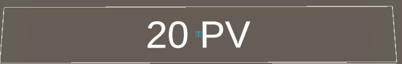
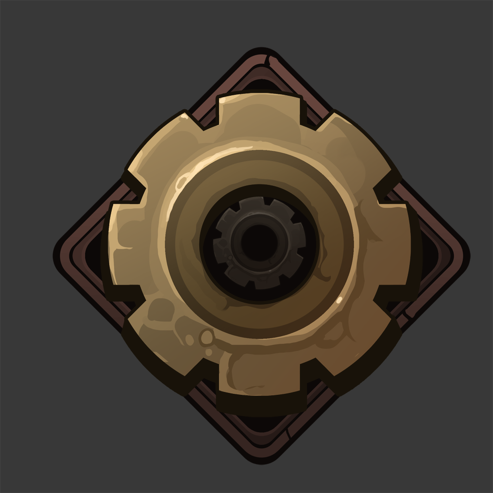

# Chapitre 13 : Système de Points de Vie
## Introduction

Bienvenue dans le treizième chapitre de notre cours CodeGaming, axé sur l'ajout et la gestion des points de vie dans votre jeu de Tower Defense 3D. 🛡️

## Objectifs du Chapitre

- Ajouter les points de vie du joueur à l'UI.
- Créer et implémenter un script LivesUI pour afficher les points de vie.
- Ajouter la capacité aux ennemis d'infliger des dégâts.
- Développer un script GameManager pour gérer le début et la fin du jeu.
- Ajouter des points de vie aux ennemis et les capacités à recevoir des dégâts.
- Créer un script Bullet pour définir différents types de dégâts liés aux tours.

### Étape 1 : Intégration des Points de Vie dans l'UI 🖥️



#### Modifier l'UI :
Ajoutez un élément dans votre interface utilisateur qui affiche les points de vie du joueur.

#### Script LivesUI :
Écrivez un script qui met à jour l'affichage des points de vie du joueur en temps réel.

(Le même code que moneyUI mais cette fois pour des PV)

### Étape 2 : Dégâts des Ennemis et Gestion des Points de Vie 🔪
#### Script des Ennemis :
Modifiez le script des ennemis pour leur permettre d'infliger des dégâts au joueur.

#### Définir les Dégâts :
Créez une méthode pour diminuer les PV du joueur ou d'autres entités lorsqu'elles sont touchées par des ennemis.

voici le code a recopiez mais ou ?

```csharp
EndPath();

private void EndPath()
{
  PlayerStats.lives--;
  Destroy(gameObject);
}

```

### Étape 3 : Développement du GameManager 🎮



#### Gestion du Début et de la Fin du Jeu :
Structurez le script [GameManager](https://github.com/user-attachments/files/17848305/GameManager.txt) pour déclencher le début et la fin du jeu basé sur les conditions comme les points de vie du joueur.

#### Intégration de la Logique de Fin de Jeu :
Déterminez ce qui se passe quand les points de vie du joueur atteignent zéro.

### Étape 4 : Création de Points de Vie pour les Ennemis 🎯
#### Ajouter des PV aux Ennemis :
Implémentez un système de points de vie pour les ennemis qui diminue lorsqu'ils subissent des dégâts.

Attention les variables sont à vous de les créer.

```csharp
    public void TakeTamage(float amount)
    {
        health -= amount;
        if (health _______ 0)
        {
            Die();
        }
    }

    private void Die()
    {
        GameObject deathParticle = (GameObject)Instantiate(deathEffect,__________.position, Quaternion.identity);
        PlayerStats.Money += value; // On souhaite gagner de l'argent
        Destroy(_________, 4f); // Détruire les particules dans 4 secondes
        __________(gameObject); // Détruire la bullet
    }
```

### Étape 5 : Script Bullet pour Différents Dégâts 💥
#### Modifier le Script Bullet:
Élaborez une fonction qui applique des dégâts variables aux ennemis en fonction du type de tour d'où la balle a été tirée.

Attention les variables sont à vous de les créer.

```csharp
    void Damage(Transform enemy)
    {
        Enemy e = enemy.GetComponent<Enemy>();

        if (e != null)
        {
            e.TakeTamage(damage);
        }
    }
```

## Conclusion
Avec ces améliorations, vous donnerez une nouvelle dimension stratégique et dynamique à votre jeu en introduisant des systèmes de points de vie et de dégâts. Cela enrichit fortement l'expérience de jeu et ajoute des éléments critiques pour maintenir le joueur engagé. 🏹✨

Rendez-vous au prochain chapitre pour explorer [l'ajout d'une autre tour ! 🚀](https://github.com/g404-code-gaming/TowerDefence/blob/main/Création-Du-Jeu/14.Ajout%20de%20la%20tourelle%20laser.md) 

