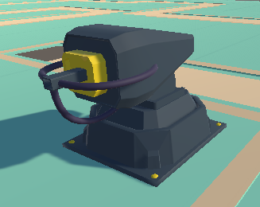

# Chapitre 14 : Ajout d'une Tourelle Laser

## Introduction

Bienvenue dans le quatorzième chapitre de notre cours CodeGaming, où nous allons enrichir votre jeu avec l'ajout d'une tourelle laser. ⚡

## Objectifs du Chapitre

- Créer et configurer les composants de la tourelle laser. 🏗️
- Attacher un script dédié et créer le prefab de la tourelle. 💡
- Ajouter un bouton dans l'UI pour sélectionner la tourelle laser. 🖱️
- Modifier les scripts BuildManager et Shop pour inclure la nouvelle tourelle. 👨‍💻
- Mettre en place un LineRenderer pour le laser. 🔷
- Ajuster les variables pour un rendu fin du laser et ajouter un matériau coloré. 🌈
- Adapter le script Turret pour permettre le tir du laser. 🔥

### Étape 1 : Création et Configuration de la Tourelle Laser 🔧

#### Créer la Structure de la Tourelle :
Dans Unity, crée un nouvel objet 3D pour ta tourelle.
Ajoute les composants nécessaires : FirePoint, PartToRotate, etc. 🔄

#### Attacher le Script Tourelle:
Assure-toi d'avoir un script dédié à la tourelle et attache-le à l'objet. 📝

#### Créer le Prefab :
Une fois configuré, crée un prefab à partir de ta tourelle laser. 📦

### Étape 2 : Intégration dans l'UI 🖱️

#### Ajouter un Bouton pour la Tourelle Laser :
Dans ton UI, ajoute un bouton pour sélectionner et créer la tourelle laser.

#### Modifier BuildManager et Shop :
Update les scripts pour inclure la nouvelle tourelle dans la construction et l'achat de tours.

### Étape 3 : Création du LineRenderer pour le Laser 🔦

#### Configurer le LineRenderer:
Ajoute un composant LineRenderer à votre tourelle laser.
Configure ses propriétés pour créer un faisceau laser fin.

#### Appliquer un Matériau Coloré :
Ajoute un matériau coloré au LineRenderer pour donner vie au laser.

### Étape 4 : Adaptation du Script Turret 📜
#### Modifier le Script pour le Mode Laser :
Met à jour le script de Turret pour gérer le tir continu du laser lorsqu'une cible est en vue.

#### Gestion des Dégâts Continus : 💥
Assure-toi que le script inflige des dégâts sur la durée tant que le laser reste activé sur la cible.

## Conclusion
Avec cette nouvelle tourelle laser, ton jeu gagne une dimension supplémentaire en termes de stratégie et d'options défensives.🚀 Le laser offre une méthode de neutralisation continue des ennemis, apportant diversité et dynamique au gameplay. 🎮✨
