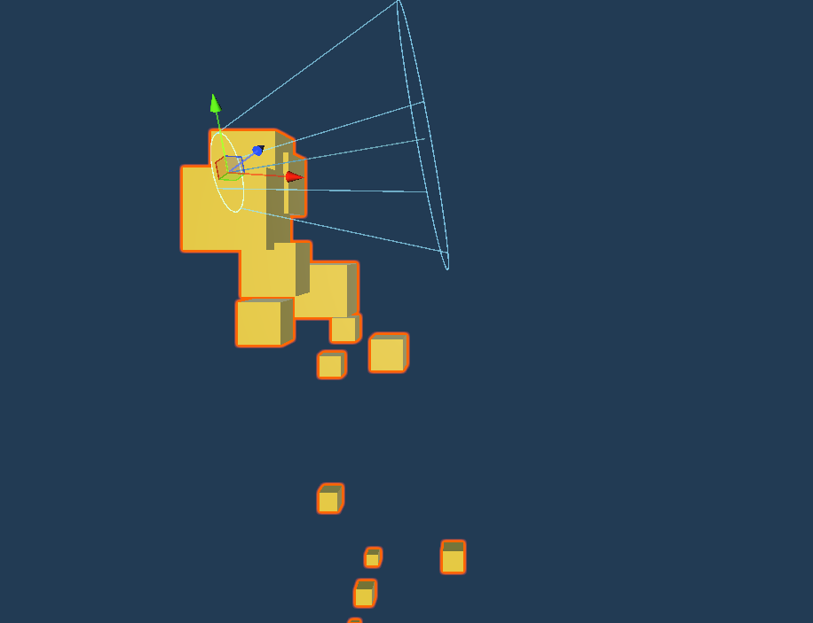
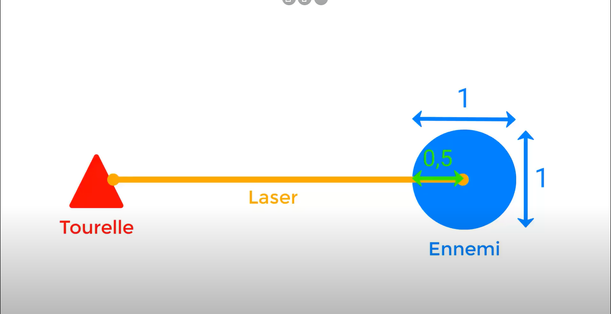

# Chapitre 15 : Effets de Particules pour la Tourelle Laser 🌌

## Introduction

Bienvenue dans le quinzième chapitre de notre cours CodeGaming ! Aujourd'hui, nous allons ajouter un effet visuel impressionnant à votre tourelle laser grâce au système de particules lors de l'impact avec une cible. 🌟🔫

## Objectifs du Chapitre

- Créer un système de particules pour l'impact du laser. 💥
- Inclure une lumière dans le système de particules pour ajouter du réalisme. 💡
- Créer le prefab du système de particules. 📦
- Modifier le code de la tourelle pour activer ces particules à l'impact. 👨‍💻
- S'assurer que les particules ne se génèrent pas au centre de l'objet tiré. 🧮

### Étape 1 : Création du Système de Particules 🌠
#### Configurer le Système de Particules :
Dans Unity, crée un nouvel objet de système de particules.
Ajuste les paramètres pour obtenir l'effet visuel souhaité lors de l'impact. ✨

#### Ajouter une Lumière :
Intègre une lumière au système de particules pour créer un éclairage dynamique lorsqu'elles apparaissent. 🔆

### Étape 2 : Création du Prefab 🚀
#### Créer le Prefab du Système de Particules :
Une fois satisfait du rendu, crée un prefab à partir de ta configuration de particules.

### Étape 3 : Intégration dans le Code de la Tourelle 👾

#### Calcul Mathématique pour le Positionnement :
Implémente une logique pour positionner les particules au point d'impact précis du laser, pas au centre de la cible. Par exemple, utilise la normale de la surface touchée pour ajuster la position. 📐

#### Modifier le Script Turret:
Ajoute une référence au prefab de particules dans le script de la [tourelle](https://github.com/user-attachments/files/17978219/Turret4.txt) et l'implémenter dans votre gameplay.

## Conclusion
En enrichissant votre gameplay avec des effets de particules à l'impact, vous apportez du dynamisme et de l'immersion visuelle à votre jeu de Tower Defense. 🚀🌈 

Continuez à expérimenter et à affiner ces éléments pour créer une expérience encore plus captivante pour vos joueurs grâce [a l'ajout des dégats ! 🎮✨](https://github.com/g404-code-gaming/TowerDefence/blob/main/Création-Du-Jeu/16.Dégâts%20et%20ralentissement%20du%20laser.md)

