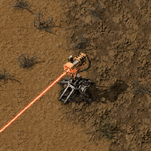

# Introduction au Chapitre : Dégâts et Ralentissement des Tourelles Laser 🌟
Bienvenue dans ce chapitre dédié à l'art stratégique de l'utilisation des tourelles laser dans notre Tower Defense 3D. Aujourd'hui, nous allons explorer comment ces tourelles peuvent non seulement infliger des dégâts considérables, mais aussi ralentir les ennemis pour mieux les neutraliser. Prêts à transformer vos tourelles en armes redoutables ? 🚀💥

## Contenu du Cours 🎯
### Concepts Clés :
- Dégâts : Les tourelles laser infligent des dégâts directs aux ennemis.
- Ralentissement : Effet temporaire qui réduit la vitesse des ennemis touchés.
- Cible : Choisir efficacement quelles cibles attaquer.



## Modification des Scripts :
### Séparation en 2 script :

Le script Enemy sera scindé en deux scripts : Enemy pour les caractéristiques et EnemyMovement pour les déplacements, avec quelques ajustements nécessaires, notamment sur la vitesse du personnage, pour assurer un fonctionnement optimal.

Coder cette partie dans le script enemy en remplacant les mots entre guillemet.

```csharp
    public void Slow(float "ralentissement")
    {
        "votre vitesse" = "Speed de départ" * (1f - "ralentissement");
    }
```
    
## Script Turret :
Logique pour tirer et infliger des dégâts ainsi que ralentir l'ennemi.

J'aimerais que, lorsqu'on utilise le laser, l'ennemi subisse des dégâts progressifs et soit ralenti. Pour cela, créez deux variables : une pour les dégâts par seconde (DamageOvertime) et une pour le facteur de ralentissement (slowAmout). Utilisez ces variables pour appeler les fonctions TakeDamage et Slow présentes dans le composant Enemy.

## Stratégies de Jeu :
Utilisation efficace des ralentissements pour contrôler le flux des vagues ennemies.
Optimisation du placement des tourelles pour maximiser les dégâts.

# Conclusion et Débriefing 🤔
En combinant les dégâts et le ralentissement, les tourelles laser deviennent des atouts majeurs dans la défense de votre base. Maintenant que vous avez les outils pour modifier et adapter vos scripts, réfléchissez à comment vous pouvez incorporer d'autres mécaniques de contrôle pour enrichir vos stratégies de défense. Pensez à tester différents réglages pour découvrir ce qui fonctionne le mieux pour vous. À vos claviers, et que la force du code soit avec vous ! ⚔️👾

N'oubliez pas de sauvegarder vos modifications et de faire des tests réguliers pour vous assurer que vos ajustements rendent le jeu aussi captivant que possible. Bon courage ! 💪🎮

Prochaine étape le [Menu de Fin](https://github.com/g404-code-gaming/TowerDefence/blob/main/Création-Du-Jeu/17.Menu%20de%20Fin%20%2B%20animation.md)
