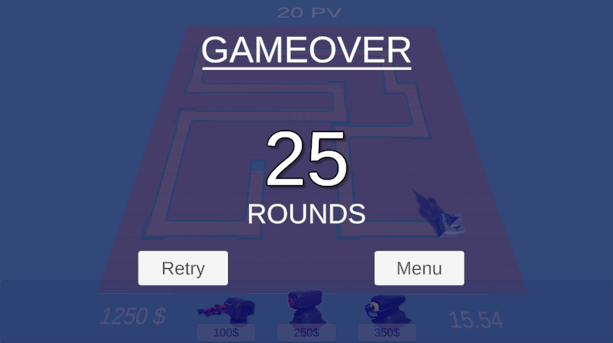

# Introduction au Chapitre : Création du Menu de Fin de Partie 🏁
Bienvenue dans le nouveau chapitre où nous allons explorer la conception et l'implémentation du menu de fin de partie. L'objectif est d'offrir une expérience immersive aux joueurs en leur permettant de voir leurs scores finaux et de savourer un écran de victoire engageant. Prêts à terminer la partie en beauté ? 🎉🏆

# Contenu du Cours 🎨
## Construction de l'UI de Fin de Partie :
Créer une interface utilisateur élégante pour la fin de partie.
Intégrer des éléments visuels comme le score final, les statistiques du joueur, et un bouton pour rejouer.

## Création du Script GameOver :
Affichage des scores et des messages de fin de partie grace au script [GameOver](https://github.com/user-attachments/files/18006818/GameOver.txt).

## Ajustement des Autres Scripts :
- Game Manager : Faire apparaitre le menu de fin en déclarant et activant a "true" menu.
- CameraController : Empécher le deplacement de la caméra dans les menu avec un simple if(...){return;} dans la première ligne du return.
- PlayerStats : Ajouter la variable pour les rounds et initialiser a 0.
- WaveSpawner : Récupérer la variable rounds de playerStats et ajouté 1 lors de l'apparition de la nouvelle vague.

## Amélioration Graphique :
Ajouter des animations fluides : fondu enchaîné, glissements, etc.
Utiliser des transitions pour effectuer un passage harmonieux vers l'écran de fin.

## Points Clés pour la Mise en Œuvre 🔑
- Arrêt de la Game Loop : Assurez-vous que tous les processus actifs du jeu soient en pause lors de l'affichage du menu de fin.
- Design Cohérent : Gardez une esthétique globale en harmonie avec le reste du jeu.
- Feedback Joueur : Renforcez l'engagement en fournissant des informations claires sur la performance du joueur.

## Conclusion et Débriefing 🗣️
Finaliser le jeu avec un écran de fin de partie bien conçu laisse une impression durable sur le joueur. Cela marque non seulement la fin d'un cycle, mais donne également l'occasion au joueur de réfléchir à sa stratégie et de s'améliorer. N'hésitez pas à ajouter votre touche personnelle pour rendre cette étape mémorable. Profitez de cette opportunité pour affiner vos compétences en design d'interface et offrir des expériences inoubliables ! 🎮✨

Poursuivons avec la [création du menu pause](https://github.com/g404-code-gaming/TowerDefence/blob/main/Création-Du-Jeu/18.Menu%20Pause.md), une fonctionnalité cruciale qui permettra aux joueurs de gérer leur partie en cours. Le menu pause intégrera des options telles que la reprise de la partie, l'accès aux paramètres et l'arrêt de la session de jeu. Préparez-vous à ajouter des fonctionnalités interactives et à améliorer l'ergonomie de l'expérience utilisateur en jeu. 🕹️⏸️

