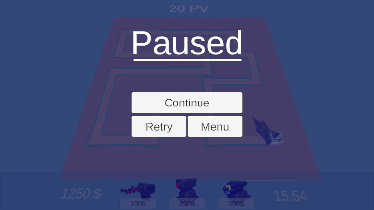
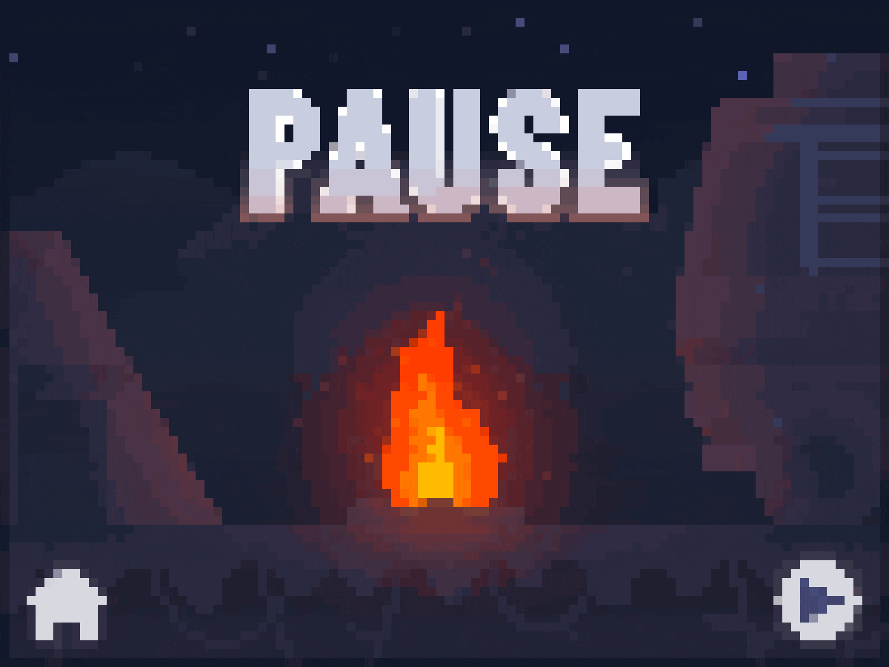

# Introduction au Chapitre : Création du Menu Pause 🚦
Dans ce chapitre, nous allons explorer la mise en place d'un menu pause qui permettra au joueur de mettre le jeu en pause à tout moment. Le but est d'offrir une flexibilité accrue tout en maintenant une expérience utilisateur harmonieuse. Préparez-vous à apporter une nouvelle dimension de contrôle à votre jeu ! ⏸️🕹️

## Contenu du Cours 🧩
### Création du Menu In-Game :
Conception d'une interface utilisateur pour le menu pause.

Intégration des boutons de reprise, recommencer et retour au menu principal.

### Création du Script MenuPause :
Gestion de la pause du jeu : interrupteur pour mettre le jeu en pause/reprendre.

Mise en place de la logique pour afficher/masquer le [menu pause](https://github.com/user-attachments/files/18007425/MenuPause.txt).

### Atelier : Améliorer l'UI avec des Animations et Éclairage :
- 📜 Animations : Utiliser des effets de transition pour rendre l'affichage des menus dynamique et engageant.
- 💡 Jeu de Lumière : Intégrer des effets lumineux pour renforcer l'ambiance du jeu.

### Points Clés pour la Mise en Œuvre 🎯
- Fonctionnalité de Pause : Permettre un arrêt complet du temps de jeu pour une vraie pause.
- Interface Intuitive : Créer une interface utilisateur qui soit claire et simple à naviguer.
- Optimisation des Entrées : Assure-toi que chaque action utilisateur a un impact distinct, sans conflits.

### Conclusion et Débriefing 💬
Établir un menu pause bien pensé améliore significativement l'expérience utilisateur en offrant un contrôle supplémentaire lors des sessions de jeu. Cette fonctionnalité est cruciale pour maintenir l'engagement tout en offrant des moments de répit nécessaires. Utilisez votre créativité pour concevoir un menu visuellement attrayant et fonctionnel. 🎨✨

Le menu pause est en place et le prochain chapitre portera sur l'affichage d'une [barre de vie pour vos ennemis. 🎮](https://github.com/g404-code-gaming/TowerDefence/blob/main/Création-Du-Jeu/19.Barre%20de%20vie%20des%20ennemis.md)

