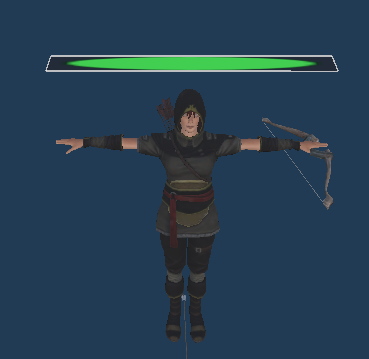
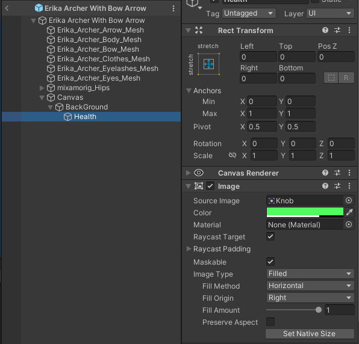

# Introduction au Chapitre : Ajout de Barres de Vie aux Ennemis 💉
Dans ce chapitre, nous allons ajouter un élément visuel essentiel à vos ennemis : la barre de vie. Cela permettra aux joueurs d'évaluer rapidement l'état de santé des ennemis sur le champ de bataille, rendant le gameplay plus interactif et stratégique. Préparez vos souris pour une session de création colorée ! 🖌️👾

## Contenu du Cours 🖌️
Création d'une UI Intégrée :
Concevoir une barre de vie visible sur chaque ennemi.
Utiliser des images de couleur qui diminueront en taille proportionnellement à la santé restante. 🌡️📉



## Implémentation de la HealthBar :
Ajouter une fonction pour gérer la mise à jour de la HealthBar.
Synchroniser l'affichage graphique avec les points de vie actuels. 🔄

## Étapes de Réalisation 🔧
### Étape 1 : Création de la HealthBar 🛠️

Ajoutez l'UI dans le prefab de nos ennemies avec une image de barre de vie.

Assurez-vous que la barre de vie est bien positionnée au-dessus des ennemis.



### Étape 2 : Script Enemy Modification ✏️
Ajoutez des méthodes pour initier et mettre à jour la barre de vie en fonction des points de vie.

Voici les quatres lignes de codes a implémenter. A vous de trouver leur emplacement !

```csharp
    public float health,HealthMax = 100;

    health = HealthMax;

    public Image HealthBar;

    HealthBar.fillAmount = health /HealthMax;

```

## Conclusion et Débriefing 🎯
Introduire des barres de vie pour vos ennemis enrichit visuellement le jeu et fournit un retour immédiat aux joueurs sur leur progression. En concevant une UI intuitive et fonctionnelle, vous allez non seulement améliorer l'esthétique du jeu, mais aussi renforcer son aspect stratégique. Continuez à innover et amusez-vous en menant ce projet au niveau supérieur ! 🏆✨

Préparez vous car le prochain cours abordera la révision du [système de vagues](https://github.com/g404-code-gaming/TowerDefence/blob/main/Création-Du-Jeu/20.Mise%20à%20jour%20des%20vagues.md), vous permettant de créer vos propres vagues en définissant le nombre d'ennemis souhaité. 🌊👾
