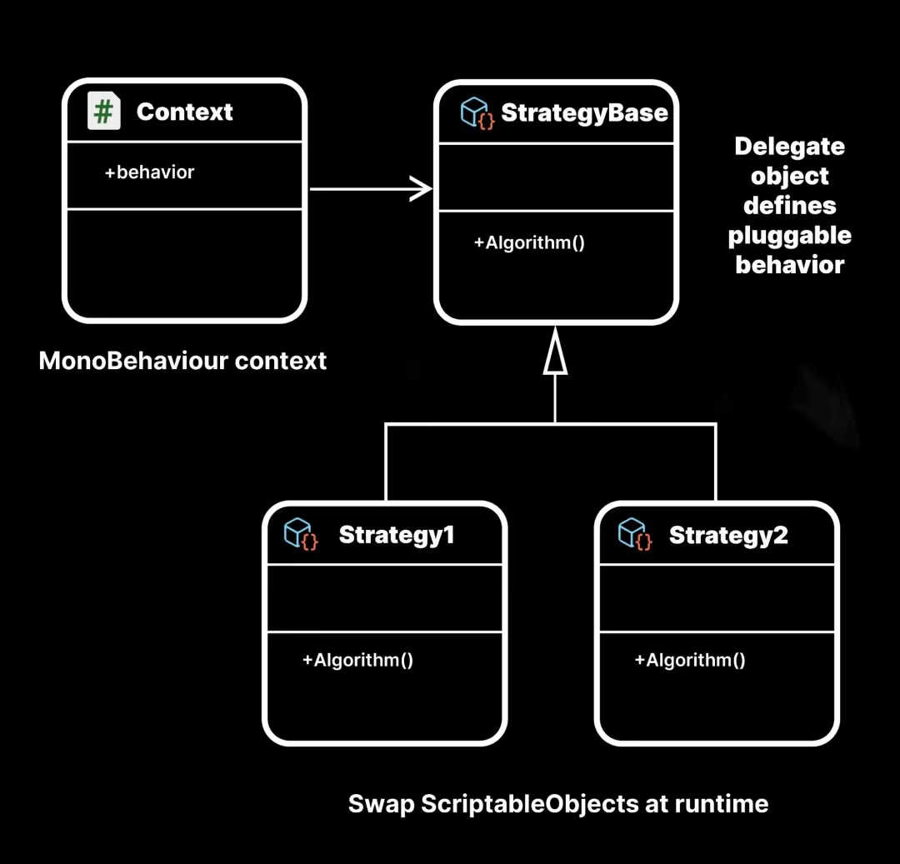

# Introduction au Chapitre : Optimisation du Système de Vagues d'Ennemis 🌊
Dans cet avant-dernier chapitre, nous allons nous attaquer à l'un des aspects les plus excitants et stratégiques de votre jeu : le système de vagues d'ennemis. À cause de dysfonctionnements à certains niveaux de manches, il est essentiel de restructurer ce système pour garantir une expérience de jeu fluide et cohérente. Préparez-vous à maîtriser l'art des vagues ennemies ! ⚔️👹

## Contenu du Cours 🔍
### Création d'un Scriptable Object pour les Vagues :
Qu'est-ce qu'un Scriptable Object ? C’est un puissant outil de stockage de données permettant la réutilisation et la gestion simple des configurations de jeu sans coder. 📄💡
Conception d'un Scriptable Object Waves pour organiser et structurer les vagues ennemies.

### Retouche de Scripts :
- [WaveSpawner](https://github.com/user-attachments/files/18020642/WaveSpawner2.txt) : Adapter le spawner pour gérer les nouvelles configurations de vagues.
- Enemy : On dois décrémenter le nombre d'ennmie presente dans la vague a sa mort.
- EnemyMovement : On dois décrémenter le nombre d'ennmie presente dans la vague si il atteint le batiment a défendre.

### Création et Personnalisation des Vagues :
Remplissez vos vagues avec des ennemis selon vos designs pour créer des niveaux uniques et stimulants. 🛠️🎮

### Bonus : Créer un écrans de victoire 🌟🌟

A vous de concevoir un écran de victoire qui s'affiche lorsqu'une partie est gagnée, permettant ainsi de célébrer le succès du joueur.

### Points Clés pour la Mise en Œuvre 🔑
- Structure Coherente : Assurez-vous que chaque vague est bien définie pour éviter les chevauchements.
- Diversité des Ennemis : Jouez sur la diversité des types d'ennemis pour enrichir le gameplay.
- Test et Ajustement : Testez chaque manche pour vérifier la balance et l'équilibre du jeu.

### Conclusion et Débriefing 🧠
En redéfinissant votre système de vagues grâce aux Scriptable Objects, vous allez transformer votre jeu en une expérience plus raffinée et stratégique, tout en vous offrant la flexibilité d’adapter les défis proposés aux joueurs. Profitez de ces nouvelles capacités pour créer des niveaux à la hauteur de votre imagination ! 🚀🌟

Bon courage et que la vague soit en votre faveur ! 🌊😉 Prochaine et dernière étape l'ecrans de [Menu principal ainsi qu'un écrans de sélection de niveau.](https://github.com/g404-code-gaming/TowerDefence/blob/main/Création-Du-Jeu/21.Menu%20Principal%20et%20sélection%20de%20niveaux.md)

