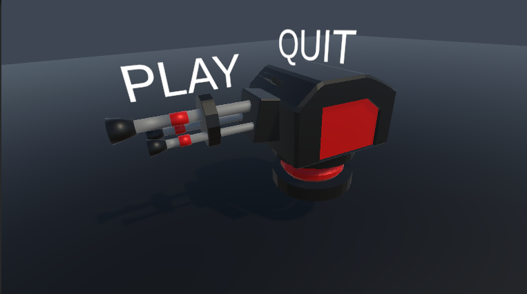
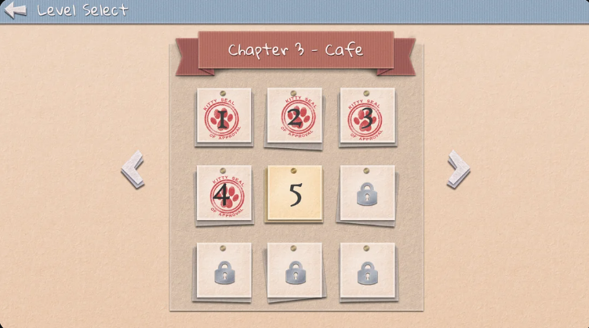

# Introduction au Chapitre : Création du Menu Principal et Sélection de Niveau 🎮
Bienvenue dans ce dernier chapitre où nous allons magnifier l'accueil de votre jeu en créant un menu principal élégant et une interface de sélection de niveaux. L'objectif est de proposer une expérience utilisateur fluide et séduisante dès le lancement du jeu. Prêt à créer une première impression inoubliable ? 🏠✨

## Contenu du Cours 🖼️
### Création d'un Menu Principal avec Canvas Overlay :
Utilisation du Canvas Overlay pour concevoir un menu principal épuré et attrayant.

Intégration des objets graphiques et animations pour enrichir visuellement la scène.

À vous de créer le script qui permettra de naviguer fluidement entre les différentes scènes du jeu, comme le menu principal et l'écran de Gameplay. 🚀🎮

### Création d'une UI pour la Sélection de Niveau :
Conception intuitive permettant aux joueurs de choisir parmi plusieurs niveaux créés. 📜🏆

### Développement du Script Selection de niveaux :
Écrire un script qui gère la navigation fluide entre les différents écrans du menu.

Gestion des transitions et des interactions utilisateur pour un parcours sans accrocs.

### Étapes Clés pour la Mise en Œuvre 👨‍💻
- Design Cohérent : Assurez-vous que l'esthétique générale du menu est en accord avec le style du jeu.
- Interactivité : Facilitez la navigation et l'interaction pour une expérience utilisateur immersive.
- Expérimentation Visuelle : N'hésitez pas à jouer avec les couleurs, les animations et les dispositions pour atteindre le design souhaité.

## Conclusion et Débriefing 🏆
La création d'un menu principal et d'une interface de sélection de niveaux bien conçus marquent la dernière étape vers un jeu complet et professionnel. Cela engage directement le joueur dans l'univers que vous avez créé et offre une structure solide pour démarrer l’aventure.🎨🚀

Bravo pour votre parcours jusqu'ici ! Profitez de cette dernière couche de polissage pour faire briller votre jeu et apporter votre touche finale unique. À vous de jouer pour captiver dès le premier écran ! 🌟👏
